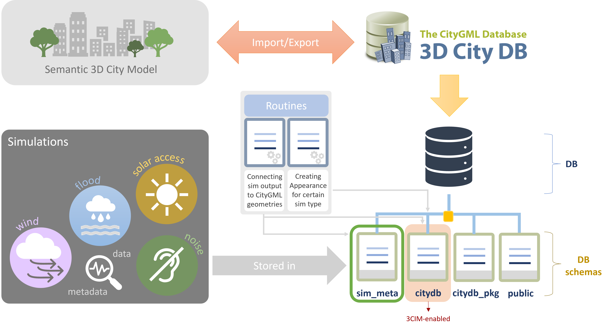

# sim_meta - structure

## Overview
This repository is dedicated to storing the code for creating a PostgreSQL database that stores output from different types of simulations in a FAIR way. The database is meant to be stored inside 3DCityDB in a separate schema within the same database as the corresponding CityGML model that was used as input to the simulations. The figure below presents an overview of the designed structure and corresponding information flow.

 
 

</img>

 
 

## Introduction
This repository contains SQL-scripts and Python code for creating
simulation output tables in the sim_meta database schema, linking
them to CityGML geometries in citydb and creating appearances for
them as described in the manuscript titled "Storing and visualizing
simulation output linked to semantic 3D city models in a FAIR framework".
More in particular, the repository contains code for:

1. creating and initialising the tables in the sim_meta database schema within 3DCityDB. 
2. linking simulation output to CityGML openings & creating appearances
3. linking simulation output to CityGML WallSurfaces & creating appearances
4. linking simulation output to CityGML TINRelief & creating appearances
5. executing complex SQL-queries combining more than one type of sim outputs
   that are also considering semantic attributes of relevant CityGML objects
   (e.g. building).
 
 

## Organisation
The "0_create_tables" folder contains indicatory SQL-scripts for creating &
initializing the tables storing output from different simulation types. 

The "1_sim_out_linked_to_openings" folder contains indicatory SQL-scripts for 
linking simulation output to CityGML openings (e.g., windows) and creating the
corresponding X3D colour appearances.

The "2_sim_out_linked_to_wallsurfaces" folder contains indicatory SQL-scripts
used for linking simulation output to CityGML WallSurfaces as well as SQL-scripts
with Python code for creating the corresponding textured appearances.

The "3_sim_out_linked_to_TINRelief" folder contains indicatory SQL-scripts for 
linking simulation output to CityGML TINRelief geometries and creating the
corresponding X3D colour appearances.

The "4_complex_sql_query" folder contains a SQL-query example that asks the database
to return buildings that do not comply to solar access and noise thresholds and whose
"class" is "habitation" (i.e., residential buildings) or "healthcare" (e.g., hospitals).
 
 

## Technical requirements
These SQL-scripts were developed for 3DCityDB v.4.x running on
pgAdmin 4 version 8.12 with PostgreSQL 17.0 and PostGIS 3.5.0.
The Python code was developed using Python 3.8.8. 
 
 

## License and Usage
This replication package is shared for peer-review purposes.
Upon formal publication of the associated manuscript, the code 
will be officially released under the BSD-3-Clause-License.
